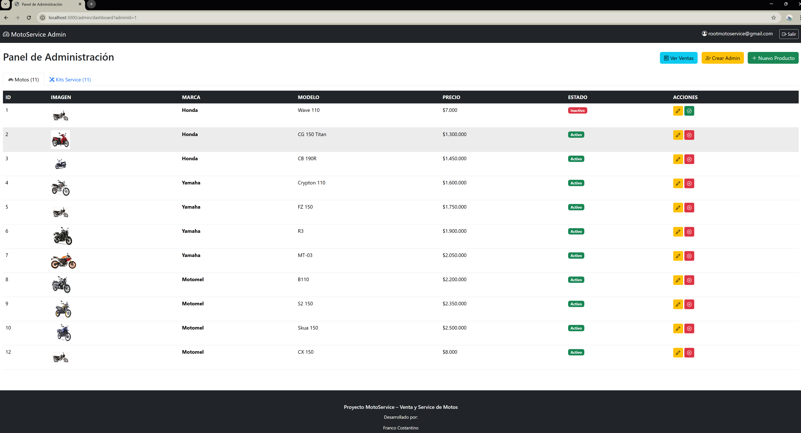
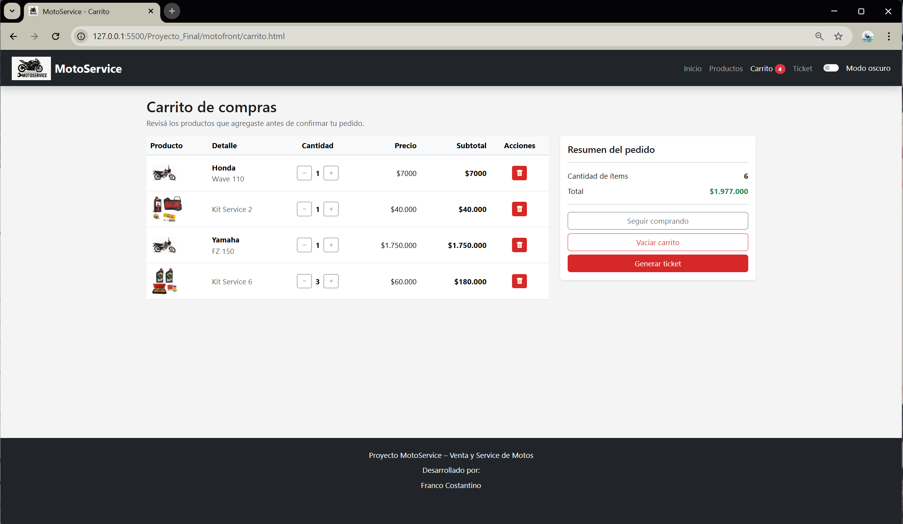
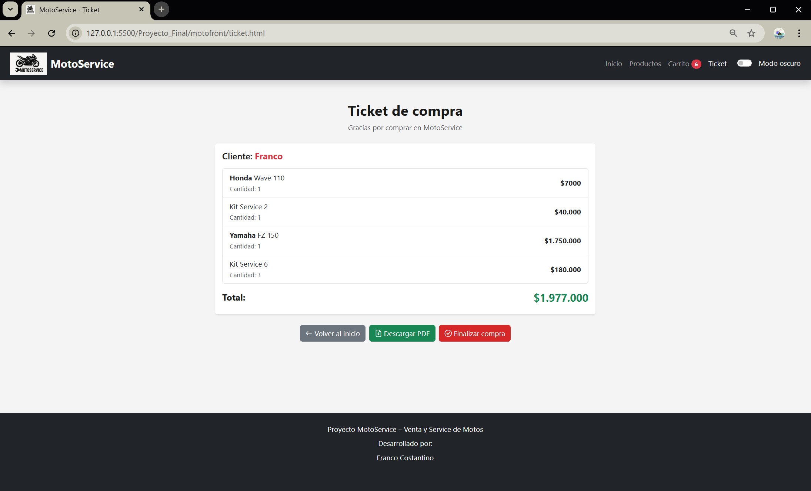
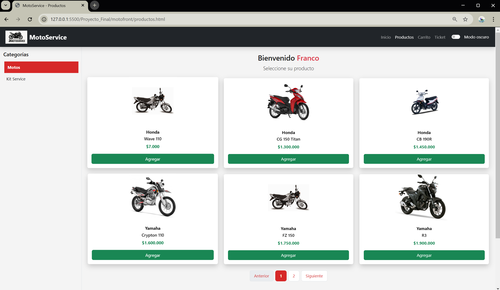

# MotoServiceWeb (Preview)

Full-stack web application designed to manage motorcycle services, product sales, and inventory in a repair shop environment.

---

##  Technologies Used

- Node.js
- Express
- Sequelize (ORM)
- MySQL
- HTML, CSS, JavaScript
- MVC Architecture
- REST API

---

##  Main Features

- User registration and authentication
- Admin panel for product management
- Shopping cart system
- Inventory tracking
- Service management workflow

---

## 🖼️ Screenshots

---

##  Project Notes

This repository is a **public preview version** created for portfolio purposes.

The original project contains full configuration files, environment variables, and additional implementation details.

---

##  Author

**Franco Costantino**

